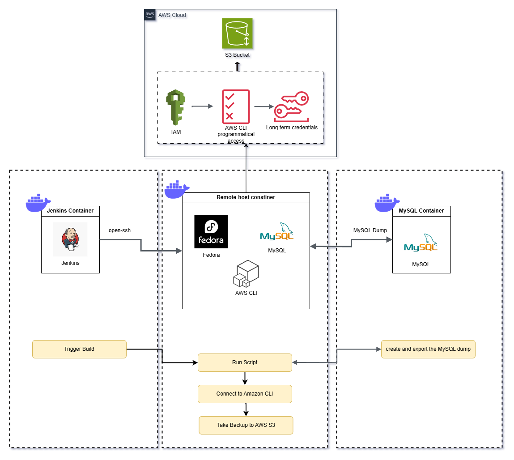

# jenkins-project
Jenkins project , creating multi container environment using docker and taking a backup of the database running on a container to AWS S3 bucket with jenkins

We rely on Jenkins for CI/CD, but a recent server crash led to the loss of critical job and configuration data due to the absence of a backup solution. To prevent future data loss and ensure fast recovery, a secure, automated backup and restore mechanism using AWS S3 needs to be implemented for the Jenkins environment.

Solution

A step by step guide is available in the jenkins-project-start.docx

This repo can be cloned and used directly.
Compatible with ubuntu and centos9 (Note: please change the docker-compose.yml file if using in distributions not supported by the current docker-compose format in the repository)

--> clone the repositroy

Bring up the project live

-->cd jenkins-projects

-->sudo usermod -aG docker admin

-->cd jenkins_data

-->docker pull jenkins/jenkins

-->sudo chown 1000:1000 jenkins_home -R

-->docker compose pull  (ignore the remote-host container as it defined in Dockerfile)

-->docker compose build

-->docker compose up -d

-->docker images  (checks the images created)

-->docker ps      ( displays the containers running, Note: 3 container should be up and running).
